## 容器安装

::: code-tabs#Script

@tab TRSS Liteyuki

```sh
bash <(curl -L gitee.com/TimeRainStarSky/TRSS_Liteyuki/raw/main/Install-Docker.sh)
```

@tab TRSS Yunzai

```sh
bash <(curl -L gitee.com/TimeRainStarSky/TRSS_Yunzai/raw/main/Install-Docker.sh)
```

@tab TRSS Sagiri

```sh
bash <(curl -L gitee.com/TimeRainStarSky/TRSS_Sagiri/raw/main/Install-Docker.sh)
```

@tab TRSS Amiya

```sh
bash <(curl -L gitee.com/TimeRainStarSky/TRSS_Amiya/raw/main/Install-Docker.sh)
```

@tab TRSS Zhenxun

```sh
bash <(curl -L gitee.com/TimeRainStarSky/TRSS_Zhenxun/raw/main/Install-Docker.sh)
```

:::

::: details 自定义功能



自定义 安装路径 `DIR` 启动命令 `CMD` 容器名 `DKNAME` （可用于多开）

举例：将脚本安装至 `/Bot` 启动命令 `trss` 容器名 `TRSS`

```sh
DIR=/Bot CMD=trss DKNAME=TRSS bash <(x
```

:::

## 容器管理

::: code-tabs#Docker

@tab 查看容器
```sh
docker ps -as
```

@tab 启动容器

```sh
docker start 容器名 # 默认开机自启，无需手动启动
```

@tab 重启容器

```sh
docker restart -t0 容器名
```

@tab 停止容器

```sh
docker stop -t0 容器名
```

@tab 删除容器

```sh
docker rm -f 容器名
```

@tab 重建容器

```sh
docker run -itd
  -h 主机名
  --name 容器名
  -v 数据路径:/root/项目名
  --restart always #自启动
  -p 主机端口:容器端口 #端口映射
  镜像名
```

:::

## 常见问题

::: details Docker 安装失败

- Docker 官方教程：<https://docker.com>
- Docker-Practice 教程：<https://vuepress.mirror.docker-practice.com/install>

:::

::: details Cannot connect to the Docker daemon at unix:///var/run/docker.sock

启动 Docker Daemon

```sh
# systemctl
systemctl enable --now docker
# service
service docker start
```

:::

::: details Got permission denied while trying to connect to the Docker daemon socket at unix:///var/run/docker.sock

添加当前用户到 docker 组

```sh
sudo usermod -aG docker $USER
```

:::

---

服务器 Linux 发行版 推荐使用 `Debian 11` 以上

若只有 `Debian 10` 以下，可执行以下命令并重启服务器后升级到 `Debian 12`

```sh
echo 'deb http://ftp.cn.debian.org/debian bookworm main contrib non-free
deb http://ftp.cn.debian.org/debian bookworm-updates main contrib non-free
deb http://ftp.cn.debian.org/debian-security bookworm-security main contrib non-free'>/etc/apt/sources.list
apt update && apt full-upgrade -y && apt autoremove --purge -y && apt clean
```
